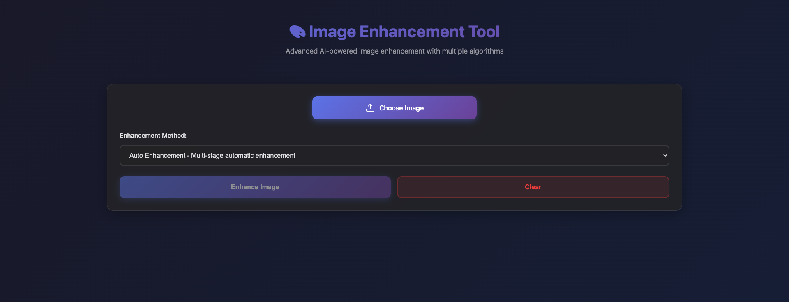
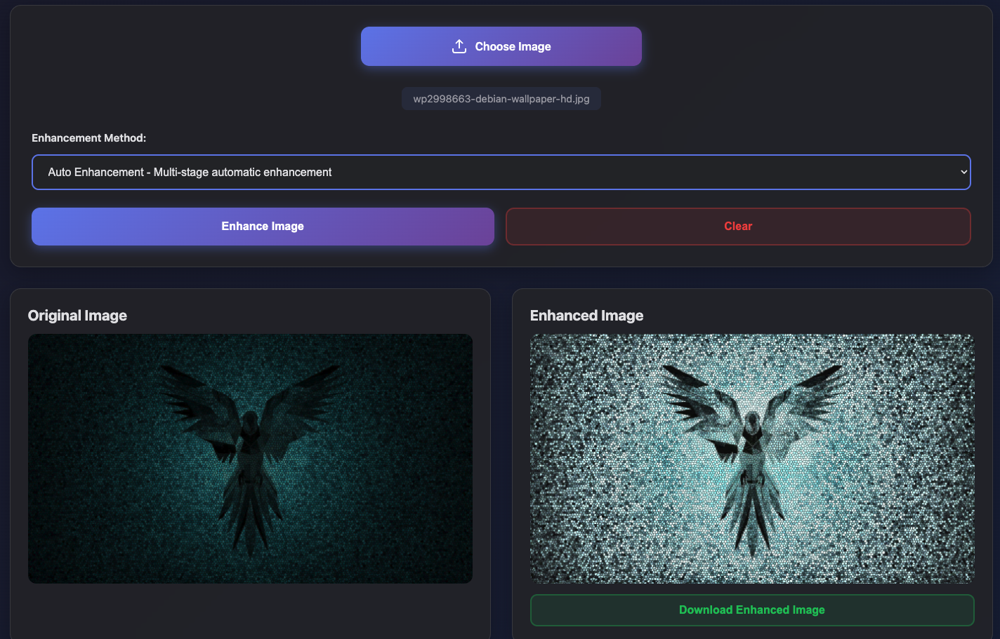
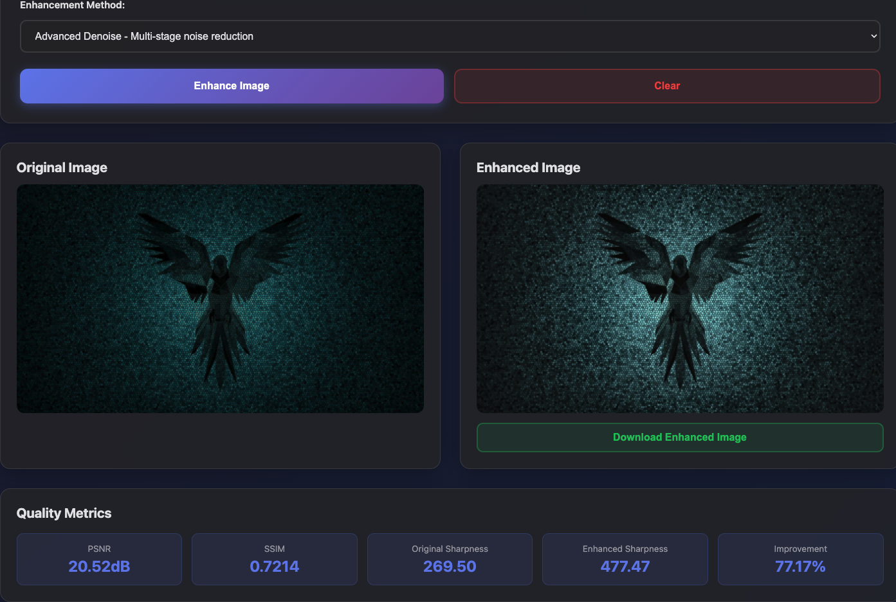
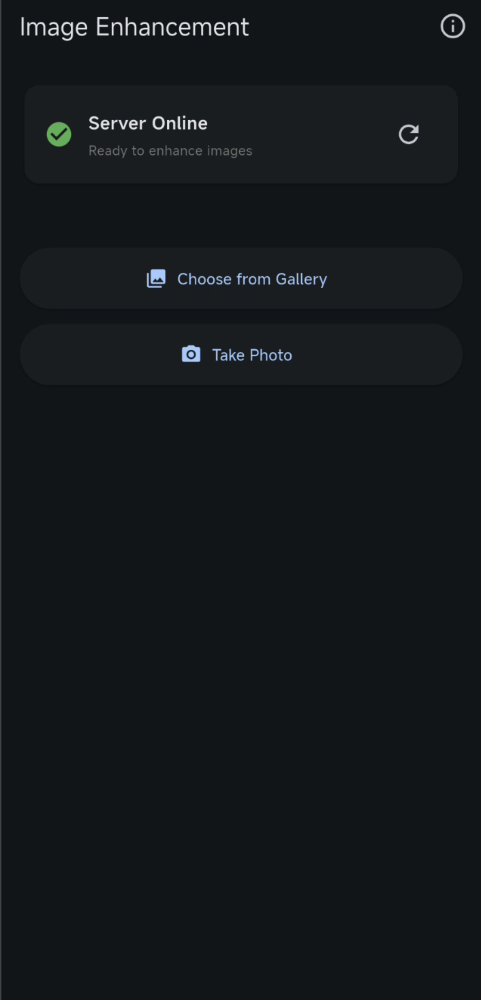
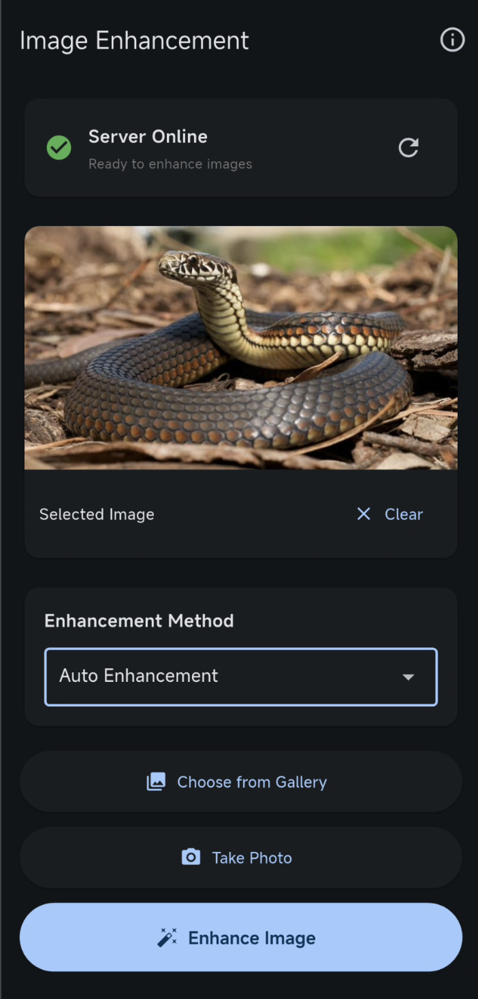
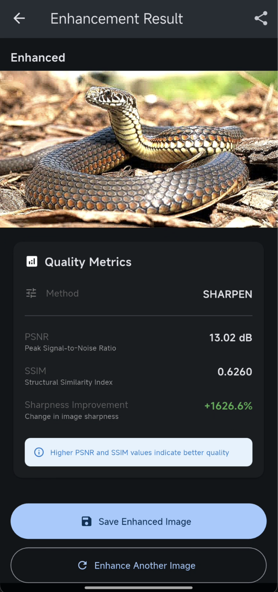
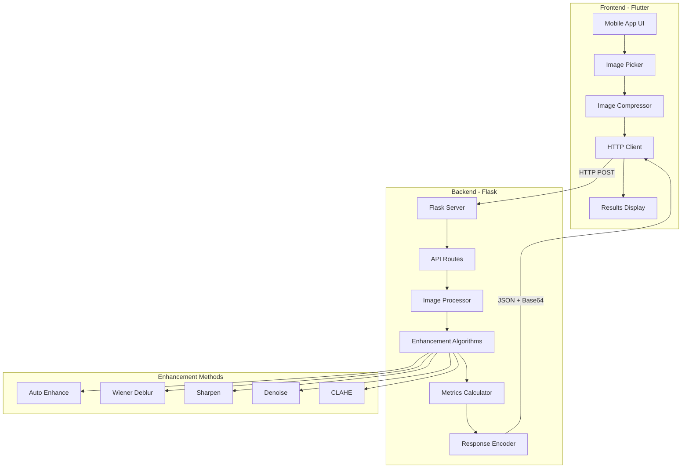
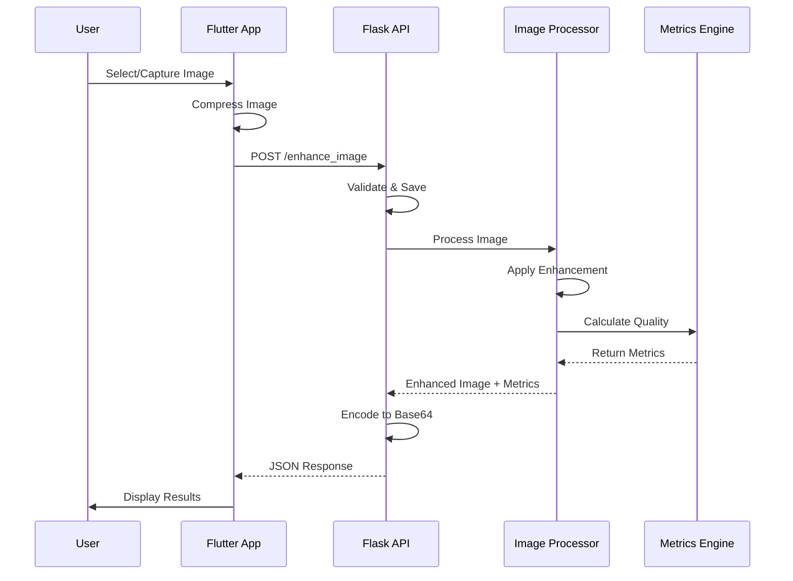
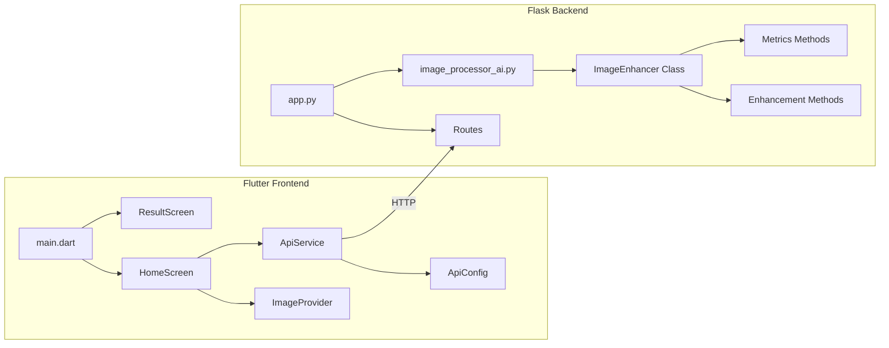

# 📸 Image Enhancement Project

A complete cross-platform image enhancement application featuring a **Flutter mobile frontend** and a **Flask Python backend** with AI-powered image processing capabilities. Upload blurry or low-quality images and get enhanced results with quality metrics.

---

## 📋 Table of Contents

- [Features](#-features)
- [Screenshots](#-screenshots)
- [System Architecture](#-system-architecture)
- [Technology Stack](#-technology-stack)
- [Prerequisites](#-prerequisites)
- [Quick Start](#-quick-start)
- [Installation Guide](#-installation-guide)
- [Configuration](#-configuration)
- [Usage](#-usage)
- [API Documentation](#-api-documentation)
- [Enhancement Methods](#-enhancement-methods)
- [Project Structure](#-project-structure)
- [Commands Reference](#-commands-reference)
- [Troubleshooting](#-troubleshooting)

---

## ✨ Features

### Image Enhancement

- **Auto Enhancement** - Intelligent automatic enhancement (recommended)
- **Advanced Deblurring** - Wiener filter-based deblurring
- **Sharpening** - Edge enhancement and detail improvement
- **Denoising** - Noise reduction algorithms
- **Brightness/Contrast** - CLAHE-based adaptive enhancement

### Quality Metrics

- **PSNR** (Peak Signal-to-Noise Ratio) - Measures image quality
- **SSIM** (Structural Similarity Index) - Perceptual similarity metric
- **Sharpness Score** - Laplacian variance-based sharpness measurement

### User Experience

- 📱 Cross-platform mobile app (iOS & Android)
- 🖼️ Before/After image comparison
- 📊 Real-time quality metrics
- 🎨 Modern, intuitive UI
- 🔒 Local processing (privacy-focused)
- 💾 Save enhanced images

---

## 📸 Screenshots

### Web Application

<div align="center">

#### Home Interface


_Clean, modern web interface with enhancement method selection_

#### Enhancement Results - Auto Enhancement


_Before and after comparison with quality metrics (PSNR: 20.52dB, SSIM: 0.72, Improvement: 77%)_

#### Enhancement Results - Advanced Denoise


_Multi-stage noise reduction with quality analysis_

</div>

### Mobile Application

<div align="center">

#### Home Screen



_Server status indicator and action buttons_

#### Image Selection & Method Choice



_Selected image preview with enhancement method dropdown_

#### Enhancement Results



_Enhanced image with detailed quality metrics and save option_

</div>

---

## 🏗️ System Architecture

### High-Level Architecture



### Request Flow



### Component Architecture



---

## 💻 Technology Stack

### Backend

- **Framework**: Flask 2.3.0
- **Image Processing**: OpenCV (cv2) 4.8.0
- **Scientific Computing**: NumPy 1.24.0, SciPy 1.11.0
- **Image Quality**: scikit-image 0.21.0
- **API**: Flask-CORS for cross-origin requests

### Frontend

- **Framework**: Flutter 3.x
- **Language**: Dart
- **State Management**: Provider 6.0.0
- **HTTP Client**: http 1.1.0
- **Image Handling**:
  - image_picker 1.0.0
  - flutter_image_compress 2.0.0
  - image_gallery_saver 2.0.0

### Development Tools

- Python 3.8+
- Flutter SDK 3.0+
- Android Studio / Xcode
- Git

---

## 📦 Prerequisites

### Backend Requirements

- **Python**: 3.8 or higher
- **pip**: Python package manager
- **Virtual Environment**: (recommended)

### Frontend Requirements

- **Flutter SDK**: 3.0.0 or higher
- **Dart SDK**: (included with Flutter)
- **IDE**: VS Code, Android Studio, or IntelliJ
- **Testing Device**:
  - Android Emulator / iOS Simulator
  - OR Physical device (Android/iOS)

### System Requirements

- **OS**: macOS, Linux, or Windows
- **RAM**: 4GB minimum (8GB recommended)
- **Storage**: 2GB free space
- **Network**: For package installation

---

## 🚀 Quick Start

### Get Running in 5 Minutes!

#### Terminal 1: Start Backend

```bash
cd Image_processing_with_python-flutter

# macOS/Linux
./start_backend.sh

# Windows
start_backend.bat
```

Wait for: `Server running on: http://127.0.0.1:5000`

#### Terminal 2: Start Frontend

```bash
cd Image_processing_with_python-flutter

# macOS/Linux
./start_frontend.sh

# Or manually
cd frontend
flutter run
```

Choose your target device and wait for the app to launch.

#### Using the App

1. ✅ **Check Status** - Green "Server Online" indicator
2. 📸 **Select Image** - Gallery or camera
3. 🎨 **Choose Method** - Auto (recommended)
4. ✨ **Enhance** - Tap "Enhance Image"
5. 👀 **View Results** - Before/After + metrics

---

## 📖 Installation Guide

### 1. Clone the Repository

```bash
git clone <repository-url>
cd Image_processing_with_python-flutter
```

### 2. Backend Setup

```bash
# Navigate to backend
cd backend

# Create virtual environment
python3 -m venv venv

# Activate virtual environment
# macOS/Linux:
source venv/bin/activate
# Windows:
venv\Scripts\activate

# Install dependencies
pip install -r requirements.txt

# Verify installation
python -c "import cv2, flask; print('Setup successful!')"
```

### 3. Frontend Setup

```bash
# Navigate to frontend
cd frontend

# Install dependencies
flutter pub get

# Verify Flutter installation
flutter doctor

# Check for issues (fix any red X's)
flutter doctor -v

# Verify app can build
flutter build apk --debug  # For Android
flutter build ios --debug  # For iOS (macOS only)
```

### 4. Directory Structure Setup

The backend automatically creates these directories on first run:

- `backend/uploads/` - Temporary uploaded images
- `backend/enhanced/` - Processed images

---

## ⚙️ Configuration

### Backend Configuration

**Option 1: Environment Variables**

Create `backend/.env` file:

```env
FLASK_APP=app.py
FLASK_ENV=development
HOST=0.0.0.0
PORT=5000
MAX_CONTENT_LENGTH=16777216  # 16MB
```

**Option 2: Direct Configuration**

Edit `backend/app.py`:

```python
app.config['MAX_CONTENT_LENGTH'] = 16 * 1024 * 1024  # File size limit
ALLOWED_EXTENSIONS = {'png', 'jpg', 'jpeg', 'bmp', 'tiff'}
```

### Frontend Configuration

Edit `frontend/lib/config/api_config.dart`:

```dart
class ApiConfig {
  // FOR EMULATOR/SIMULATOR
  static const String baseUrl = 'http://127.0.0.1:5000';  // iOS Simulator
  // static const String baseUrl = 'http://10.0.2.2:5000'; // Android Emulator

  // FOR PHYSICAL DEVICE (Replace with your computer's IP)
  // static const String baseUrl = 'http://192.168.1.XXX:5000';

  static const Duration timeout = Duration(seconds: 60);
}
```

### Finding Your Computer's IP Address

**macOS/Linux:**

```bash
ifconfig | grep "inet "
# OR
ipconfig getifaddr en0
```

**Windows:**

```cmd
ipconfig
```

Look for IPv4 Address (e.g., 192.168.1.10)

### Device-Specific Configuration

| Target Device    | API URL                 |
| ---------------- | ----------------------- |
| iOS Simulator    | `http://127.0.0.1:5000` |
| Android Emulator | `http://10.0.2.2:5000`  |
| Physical Device  | `http://YOUR_IP:5000`   |
| Web Browser      | `http://localhost:5000` |

---

## 🎯 Usage

### Starting the Application

#### 1. Start Backend Server

```bash
cd backend
source venv/bin/activate  # Activate virtual environment
python app.py
```

Expected output:

```
 * Running on http://127.0.0.1:5000
 * Server running on: http://127.0.0.1:5000
```

#### 2. Start Flutter App

```bash
cd frontend
flutter run
```

Select your device:

```
[1]: iPhone 14 (mobile)
[2]: sdk gphone64 arm64 (mobile)
[3]: Chrome (chrome)
```

### Using the Mobile App

#### Home Screen

1. **Server Status** - Check connection (green = online)
2. **Pick from Gallery** - Select existing image
3. **Take Photo** - Capture new image
4. **Enhancement Method** - Choose algorithm
5. **Enhance Button** - Process image

#### Result Screen

- **Before/After Slider** - Compare original vs enhanced
- **Quality Metrics**:
  - PSNR (higher is better)
  - SSIM (closer to 1.0 is better)
  - Sharpness improvement percentage
- **Save Image** - Download enhanced version
- **Process Another** - Return to home

---

## 📡 API Documentation

### Base URL

```
http://127.0.0.1:5000
```

### Endpoints

#### 1. Health Check

```http
GET /health
```

**Response:**

```json
{
  "status": "healthy",
  "message": "Image Enhancement API is running"
}
```

---

#### 2. Get Available Methods

```http
GET /methods
```

**Response:**

```json
{
  "methods": [
    {
      "id": "auto",
      "name": "Auto Enhancement",
      "description": "Automatic enhancement with best settings"
    },
    {
      "id": "deblur",
      "name": "Advanced Deblurring",
      "description": "Wiener filter deblurring"
    },
    {
      "id": "sharpen",
      "name": "Sharpening",
      "description": "Edge enhancement"
    },
    {
      "id": "denoise",
      "name": "Denoising",
      "description": "Noise reduction"
    },
    {
      "id": "brightness_contrast",
      "name": "Brightness/Contrast",
      "description": "CLAHE enhancement"
    }
  ]
}
```

---

#### 3. Enhance Image

```http
POST /enhance_image
```

**Request:**

- **Content-Type**: `multipart/form-data`
- **Parameters**:
  - `image` (file, required) - Image file
  - `method` (string, optional) - Enhancement method (default: "auto")

**Example using curl:**

```bash
curl -X POST http://127.0.0.1:5000/enhance_image \
  -F "image=@photo.jpg" \
  -F "method=auto"
```

**Response:**

```json
{
  "success": true,
  "message": "Image enhanced successfully",
  "enhanced_image": "data:image/jpeg;base64,/9j/4AAQ...",
  "original_image": "data:image/jpeg;base64,/9j/4AAQ...",
  "metrics": {
    "psnr": 28.45,
    "ssim": 0.92,
    "sharpness_improvement": 35.7,
    "original_sharpness": 145.2,
    "enhanced_sharpness": 197.1
  },
  "processing_time": 1.23,
  "method_used": "auto"
}
```

**Error Response:**

```json
{
  "error": "No image file provided",
  "success": false
}
```

---

## 🎨 Enhancement Methods

### 1. Auto Enhancement (Recommended)

**Algorithm**: Combined pipeline

- Non-local means denoising
- CLAHE (Adaptive histogram equalization)
- Unsharp masking for sharpening
- Bilateral filtering for edge preservation

**Best For**: General use, most images
**Processing Time**: 1-2 seconds

---

### 2. Advanced Deblurring

**Algorithm**: Wiener filter

- Frequency domain deconvolution
- Motion blur removal
- PSF (Point Spread Function) estimation

**Best For**: Motion-blurred images, out-of-focus photos
**Processing Time**: 2-3 seconds

---

### 3. Sharpening

**Algorithm**: Unsharp mask

- Gaussian blur subtraction
- Edge enhancement
- Detail amplification

**Best For**: Slightly soft images, portraits
**Processing Time**: 0.5-1 seconds

---

### 4. Denoising

**Algorithm**: Non-local means

- Noise pattern recognition
- Texture preservation
- Multi-scale processing

**Best For**: High-ISO photos, grainy images
**Processing Time**: 1-2 seconds

---

### 5. Brightness/Contrast

**Algorithm**: CLAHE

- Adaptive contrast enhancement
- Histogram equalization
- Local region adjustment

**Best For**: Underexposed photos, low contrast images
**Processing Time**: 0.5-1 seconds

---

## 📁 Project Structure

```
Image_processing_with_python-flutter/
│
├── backend/                          # Flask backend server
│   ├── app.py                       # Main Flask application
│   ├── image_processor_ai.py        # AI image enhancement (active)
│   ├── image_processor.py           # Basic image processing
│   ├── image_processor_simple.py    # Simple enhancement
│   ├── image_processor_backup.py    # Backup processor
│   ├── test_api.py                  # API unit tests
│   ├── requirements.txt             # Python dependencies
│   ├── uploads/                     # Temporary upload directory
│   ├── enhanced/                    # Enhanced images storage
│   └── templates/
│       └── index.html               # Web interface (optional)
│
├── frontend/                         # Flutter mobile app
│   ├── lib/
│   │   ├── main.dart               # App entry point
│   │   ├── config/
│   │   │   └── api_config.dart     # API configuration
│   │   ├── models/
│   │   │   └── enhancement_models.dart  # Data models
│   │   ├── providers/
│   │   │   └── image_provider.dart # State management
│   │   ├── screens/
│   │   │   ├── home_screen.dart    # Main screen
│   │   │   └── result_screen.dart  # Results display
│   │   └── services/
│   │       └── api_service.dart    # API communication
│   ├── android/                     # Android platform config
│   ├── ios/                         # iOS platform config
│   ├── test/                        # Unit tests
│   ├── pubspec.yaml                # Flutter dependencies
│   └── analysis_options.yaml       # Dart linter config
│
├── start_backend.sh                 # Backend startup script (Unix)
├── start_backend.bat                # Backend startup script (Windows)
├── start_frontend.sh                # Frontend startup script (Unix)
├── requirements.txt                 # Project dependencies
└── README.md                        # This file
```

---

## 📝 Commands Reference

### Backend Commands

#### Setup & Installation

```bash
# Create virtual environment
python3 -m venv venv

# Activate virtual environment
source venv/bin/activate              # macOS/Linux
venv\Scripts\activate                 # Windows

# Install dependencies
pip install -r requirements.txt

# Update dependencies
pip install --upgrade -r requirements.txt

# List installed packages
pip list

# Check specific package
pip show opencv-python
```

#### Running the Server

```bash
# Standard run
python app.py

# Debug mode
FLASK_DEBUG=1 python app.py

# Custom port
FLASK_RUN_PORT=8000 python app.py

# Custom host (allow external access)
python app.py --host=0.0.0.0 --port=5000
```

#### Testing

```bash
# Run all tests
python test_api.py

# Verbose output
python test_api.py -v

# Specific test
python -m unittest test_api.TestImageEnhancementAPI.test_health_check
```

#### API Testing with curl

```bash
# Health check
curl http://127.0.0.1:5000/health

# Get methods
curl http://127.0.0.1:5000/methods | python -m json.tool

# Enhance image
curl -X POST http://127.0.0.1:5000/enhance_image \
  -F "image=@test_image.jpg" \
  -F "method=auto" \
  -o response.json

# Pretty print response
cat response.json | python -m json.tool
```

#### Debugging

```bash
# Check if port is in use
lsof -i :5000                         # macOS/Linux
netstat -ano | findstr :5000          # Windows

# Kill process on port
kill -9 $(lsof -t -i:5000)           # macOS/Linux

# Check Python version
python --version

# Verify OpenCV installation
python -c "import cv2; print(cv2.__version__)"
```

---

### Frontend Commands

#### Setup & Installation

```bash
# Install dependencies
flutter pub get

# Update dependencies
flutter pub upgrade

# Check Flutter setup
flutter doctor

# Detailed diagnostics
flutter doctor -v

# Clean build files
flutter clean

# Repair packages
flutter pub cache repair
```

#### Running the App

```bash
# Run with device selection
flutter run

# Run on specific device
flutter run -d <device-id>

# Run on iOS Simulator
flutter run -d ios

# Run on Android Emulator
flutter run -d android

# Run in Chrome
flutter run -d chrome

# Run with hot reload enabled (default)
flutter run

# Run in release mode
flutter run --release

# List available devices
flutter devices
```

#### Building

```bash
# Build APK (Android)
flutter build apk

# Build App Bundle (Android)
flutter build appbundle

# Build iOS (macOS only)
flutter build ios

# Build for web
flutter build web

# Debug build
flutter build apk --debug
```

#### Testing

```bash
# Run all tests
flutter test

# Run specific test
flutter test test/widget_test.dart

# Run with coverage
flutter test --coverage

# Integration tests
flutter drive --target=test_driver/app.dart
```

#### Debugging

```bash
# Check dependencies
flutter pub deps

# Analyze code
flutter analyze

# Format code
flutter format .

# Check for outdated packages
flutter pub outdated

# View logs
flutter logs

# Clear cache
flutter clean && flutter pub get
```

---

## 🐛 Troubleshooting

### Backend Issues

#### Issue: "Port 5000 already in use"

**Symptoms**: Cannot start Flask server
**Solutions**:

```bash
# Find and kill process
lsof -i :5000
kill -9 <PID>

# Or use different port
FLASK_RUN_PORT=5001 python app.py
```

---

#### Issue: "Module not found" errors

**Symptoms**: Import errors when running app.py
**Solutions**:

```bash
# Verify virtual environment is activated
which python  # Should show path in venv

# Reinstall dependencies
pip install -r requirements.txt

# Check specific package
pip show opencv-python
```

---

#### Issue: OpenCV installation fails

**Symptoms**: Error installing opencv-python
**Solutions**:

```bash
# Install build tools (macOS)
xcode-select --install

# Install build tools (Ubuntu/Debian)
sudo apt-get install python3-dev build-essential

# Try opencv-python-headless
pip install opencv-python-headless

# Use specific version
pip install opencv-python==4.8.0.74
```

---

#### Issue: "No such file or directory: uploads/"

**Symptoms**: Error when uploading images
**Solutions**:

```bash
# Create directories manually
mkdir -p uploads enhanced

# Or let app create them (restart server)
python app.py
```

---

### Frontend Issues

#### Issue: "Server Offline" in app

**Symptoms**: Red status indicator, connection failed
**Solutions**:

1. **Check backend is running**

   ```bash
   curl http://127.0.0.1:5000/health
   ```

2. **Verify IP address** (Physical device)
   - Find computer IP: `ifconfig` or `ipconfig`
   - Update `api_config.dart`
   - Ensure same WiFi network

3. **Check firewall**
   - Temporarily disable firewall
   - Allow Python/Flask through firewall

4. **Use correct URL**
   - iOS Simulator: `http://127.0.0.1:5000`
   - Android Emulator: `http://10.0.2.2:5000`
   - Physical Device: `http://<YOUR_IP>:5000`

---

#### Issue: "Flutter doctor" shows errors

**Symptoms**: Red X's in flutter doctor output
**Solutions**:

```bash
# Android toolchain issues
flutter doctor --android-licenses

# iOS issues (macOS)
sudo gem install cocoapods
cd ios && pod install

# VS Code / Android Studio
# Install from flutter doctor suggestions

# Xcode (macOS)
sudo xcode-select --switch /Applications/Xcode.app/Contents/Developer
sudo xcodebuild -runFirstLaunch
```

---

#### Issue: "Image picker not working"

**Symptoms**: Can't select/capture images
**Solutions**:

1. **Check permissions** (iOS)
   - Open `ios/Runner/Info.plist`
   - Ensure camera/photo permissions exist

2. **Check permissions** (Android)
   - Open `android/app/src/main/AndroidManifest.xml`
   - Ensure permissions declared

3. **Simulator limitations**
   - iOS Simulator: Limited camera access
   - Use gallery instead

4. **Reinstall app**
   ```bash
   flutter clean
   flutter pub get
   flutter run
   ```

---

#### Issue: "Gradle build failed" (Android)

**Symptoms**: Build errors on Android
**Solutions**:

```bash
# Clean and rebuild
cd android
./gradlew clean
cd ..
flutter clean
flutter pub get

# Update Gradle wrapper
cd android
./gradlew wrapper --gradle-version 7.5

# Check Java version
java -version  # Should be 11 or higher
```

---

#### Issue: "Pod install failed" (iOS)

**Symptoms**: Build errors on iOS
**Solutions**:

```bash
# Update CocoaPods
sudo gem install cocoapods

# Clean pods
cd ios
rm -rf Pods Podfile.lock
pod install --repo-update

# If still fails, try
pod deintegrate
pod install
```

---

### Common Runtime Issues

#### Issue: "Image enhancement takes too long"

**Symptoms**: Timeout or slow processing
**Solutions**:

- Use smaller images (compress in app)
- Use faster methods (sharpen, brightness_contrast)
- Increase timeout in `api_config.dart`
- Check server resources (CPU, RAM)

---

#### Issue: "Out of memory" errors

**Symptoms**: Server crashes on large images
**Solutions**:

- Reduce MAX_CONTENT_LENGTH in app.py
- Add image compression in frontend
- Increase server RAM
- Use image_processor_simple.py instead

---

#### Issue: "Image quality is poor"

**Symptoms**: Enhanced image looks worse
**Solutions**:

- Try different enhancement method
- Check original image quality
- Use "auto" method for best results
- Avoid enhancing already-enhanced images

---

### Network Issues

#### Issue: "Connection timeout"

**Symptoms**: Request takes forever
**Solutions**:

```dart
// Increase timeout in api_config.dart
static const Duration timeout = Duration(seconds: 120);
```

---

#### Issue: "CORS errors" (Web version)

**Symptoms**: Browser blocks requests
**Solutions**:

```python
# Already configured in app.py, but verify:
CORS(app, resources={r"/*": {"origins": "*"}})
```

---

### Debug Mode Tips

#### Enable Verbose Logging

**Backend:**

```python
# In app.py
logging.basicConfig(level=logging.DEBUG)
```

**Frontend:**

```dart
// In api_service.dart
print('Request URL: ${uri.toString()}');
print('Response: ${response.body}');
```

#### Monitor Network Traffic

```bash
# Watch server logs
tail -f backend/app.log

# Monitor network (macOS)
sudo tcpdump -i any port 5000

# Monitor network (Linux)
sudo tcpdump -i eth0 port 5000
```

---

## 🤝 Contributing

Contributions are welcome! Please follow these steps:

1. Fork the repository
2. Create a feature branch (`git checkout -b feature/AmazingFeature`)
3. Commit your changes (`git commit -m 'Add some AmazingFeature'`)
4. Push to the branch (`git push origin feature/AmazingFeature`)
5. Open a Pull Request

---

## 📄 License

This project is licensed under the MIT License.

---

## 👨‍💻 Development Notes

### Backend Architecture

- Uses AI-powered image processor (`image_processor_ai.py`)
- Supports multiple image formats
- Automatic directory creation
- Base64 encoding for mobile compatibility
- CORS enabled for web/mobile clients

### Frontend Architecture

- Provider pattern for state management
- Separation of concerns (models, services, screens)
- Responsive UI design
- Error handling and user feedback
- Image compression before upload

### Future Enhancements

- [ ] Batch processing support
- [ ] Cloud storage integration
- [ ] Custom enhancement parameters
- [ ] Image comparison history
- [ ] Export to different formats
- [ ] Advanced AI models (Super Resolution)
- [ ] Face detection and enhancement
- [ ] Video enhancement support

---

## 📞 Support

If you encounter issues:

1. Check the [Troubleshooting](#-troubleshooting) section
2. Review [Commands Reference](#-commands-reference)
3. Verify all prerequisites are installed
4. Check Flutter doctor: `flutter doctor -v`
5. Test backend independently: `curl http://127.0.0.1:5000/health`

---

## 🙏 Acknowledgments

- OpenCV for image processing capabilities
- Flask for the lightweight web framework
- Flutter team for the amazing cross-platform framework
- scikit-image for quality metrics

---

**Made with ❤️ for image enhancement enthusiasts**

# Image Enhancement Project

A complete local inventory management system with image enhancement capabilities. The app allows users to upload blurry images via Flutter, processes them using a Flask backend with machine learning, and returns enhanced images.

## 🚀 Features

- **Image Enhancement**: Multiple enhancement methods including deblurring, sharpening, denoising
- **Quality Metrics**: PSNR, SSIM, and sharpness improvement measurements
- **Multiple Enhancement Methods**:
  - Auto Enhancement (recommended)
  - Advanced Deblurring (Wiener filter)
  - Sharpening
  - Denoising
  - Brightness/Contrast Enhancement
- **Modern UI**: Clean, intuitive Flutter interface with before/after comparison
- **Local Processing**: Everything runs on your local machine

## 📋 Prerequisites

### Backend Requirements

- Python 3.8 or higher
- pip (Python package manager)

### Frontend Requirements

- Flutter SDK 3.0.0 or higher
- Dart SDK
- Android Studio / Xcode (for emulator)
- A physical device or emulator

## 🛠️ Installation

### 1. Backend Setup (Flask)

```bash
# Navigate to backend directory
cd backend

# Create virtual environment (recommended)
python -m venv venv

# Activate virtual environment
# On macOS/Linux:
source venv/bin/activate
# On Windows:
venv\Scripts\activate

# Install dependencies
pip install -r requirements.txt

# Create environment file
cp .env.example .env

# Run the Flask server
python app.py
```

The Flask server will start on `http://127.0.0.1:5000`

### 2. Frontend Setup (Flutter)

```bash
# Navigate to frontend directory
cd frontend

# Install Flutter dependencies
flutter pub get

# Check for any issues
flutter doctor

# Run the app
# For iOS Simulator:
flutter run -d ios

# For Android Emulator:
flutter run -d android

# For Chrome (web):
flutter run -d chrome
```

## 🔧 Configuration

### Backend Configuration

Edit `backend/.env` file:

```env
FLASK_APP=app.py
FLASK_ENV=development
HOST=0.0.0.0
PORT=5000
MAX_CONTENT_LENGTH=16777216
```

### Frontend Configuration

Edit `frontend/lib/config/api_config.dart`:

```dart
// For iOS Simulator / macOS
static const String baseUrl = 'http://127.0.0.1:5000';

// For Android Emulator
static const String baseUrl = 'http://10.0.2.2:5000';

// For Physical Device (use your computer's IP)
static const String baseUrl = 'http://192.168.1.100:5000';
```

To find your computer's IP address:

- **macOS/Linux**: Run `ifconfig | grep inet`
- **Windows**: Run `ipconfig`

## 📱 Usage

1. **Start Backend Server**

   ```bash
   cd backend
   source venv/bin/activate  # if using virtual environment
   python app.py
   ```

2. **Start Flutter App**

   ```bash
   cd frontend
   flutter run
   ```

3. **Use the App**
   - Check server status indicator (should show "Server Online")
   - Tap "Choose from Gallery" or "Take Photo"
   - Select an enhancement method
   - Tap "Enhance Image"
   - View results with quality metrics
   - Save or share enhanced images

## 🧪 Testing

### Backend Tests

```bash
cd backend
python -m pytest test_api.py -v
# or
python test_api.py
```

### API Testing with cURL

```bash
# Health Check
curl http://127.0.0.1:5000/health

# Get Enhancement Methods
curl http://127.0.0.1:5000/methods

# Enhance Image
curl -X POST http://127.0.0.1:5000/enhance_image \
  -F "image=@path/to/image.jpg" \
  -F "method=auto"
```

## 📁 Project Structure

```
Image_processing_with_python-flutter/
├── backend/
│   ├── app.py                 # Flask application
│   ├── image_processor.py     # Image enhancement logic
│   ├── test_api.py           # Unit tests
│   ├── .env.example          # Environment template
│   ├── .gitignore
│   ├── uploads/              # Temporary uploads (auto-created)
│   └── enhanced/             # Enhanced images (auto-created)
│
├── frontend/
│   ├── lib/
│   │   ├── main.dart         # App entry point
│   │   ├── config/
│   │   │   └── api_config.dart
│   │   ├── models/
│   │   │   └── enhancement_models.dart
│   │   ├── providers/
│   │   │   └── image_provider.dart
│   │   ├── services/
│   │   │   └── api_service.dart
│   │   └── screens/
│   │       ├── home_screen.dart
│   │       └── result_screen.dart
│   ├── pubspec.yaml
│   └── README.md
│
├── requirements.txt           # Python dependencies
└── README.md                 # This file
```

## 🔬 Image Enhancement Methods

### 1. Auto Enhancement (Recommended)

- Combines multiple techniques for best results
- Denoising → Unsharp Masking → CLAHE → Sharpening

### 2. Deblur (Wiener Filter)

- Advanced deconvolution technique
- Best for motion blur or focus blur

### 3. Sharpen

- Unsharp masking
- Enhances edges and details

### 4. Denoise

- Non-local means denoising
- Reduces noise while preserving details

### 5. Enhance

- CLAHE-based contrast enhancement
- Improves brightness and contrast

## 📊 Quality Metrics

- **PSNR (Peak Signal-to-Noise Ratio)**: Higher is better (typically 20-40 dB)
- **SSIM (Structural Similarity Index)**: 0-1 scale, closer to 1 is better
- **Sharpness**: Laplacian variance, shows improvement percentage

## 🐛 Troubleshooting

### Backend Issues

**Server won't start:**

```bash
# Check if port 5000 is already in use
lsof -i :5000  # macOS/Linux
netstat -ano | findstr :5000  # Windows

# Kill the process or change port in .env
```

**Import errors:**

```bash
# Reinstall dependencies
pip install -r requirements.txt --force-reinstall
```

### Frontend Issues

**Cannot connect to server:**

1. Verify Flask server is running
2. Check IP address in `api_config.dart`
3. For physical devices, ensure same WiFi network
4. Disable firewall temporarily

**Build errors:**

```bash
# Clean and rebuild
flutter clean
flutter pub get
flutter run
```

**Permission errors:**

- iOS: Add camera/photo permissions in `Info.plist`
- Android: Add permissions in `AndroidManifest.xml`

## 🚀 Performance Tips

1. **Image Compression**: App automatically compresses large images before upload
2. **Server Timeout**: Adjust timeout in `api_config.dart` for slow connections
3. **Batch Processing**: Process multiple images sequentially for inventory

## 📝 API Documentation

### Endpoints

#### GET /

Health check - Returns server status

#### GET /health

Detailed health information

#### GET /methods

List available enhancement methods

#### POST /enhance_image

Enhance an image

**Request:**

- `image` (file): Image file to enhance
- `method` (string, optional): Enhancement method (default: "auto")

**Response:**

```json
{
  "success": true,
  "enhanced_image": "data:image/jpeg;base64,...",
  "original_filename": "image.jpg",
  "enhanced_filename": "enhanced_20260415_123456_image.jpg",
  "method": "auto",
  "metrics": {
    "psnr": 28.5,
    "ssim": 0.92,
    "original_sharpness": 125.3,
    "enhanced_sharpness": 187.9,
    "sharpness_improvement": 49.8
  },
  "timestamp": "2026-04-15T12:34:56"
}
```

## 🔮 Future Enhancements

- [ ] Batch image processing
- [ ] Custom enhancement presets
- [ ] Image comparison slider
- [ ] Save enhancement history with Hive
- [ ] Share enhanced images
- [ ] Deep learning models (DeblurGAN, Deep Image Prior)
- [ ] Background processing with Celery
- [ ] Real-time preview

## 📄 License

This project is open source and available under the MIT License.

## 👥 Contributing

Contributions are welcome! Please feel free to submit a Pull Request.

## 📧 Support

For issues and questions, please open an issue on GitHub.

---

**Built with ❤️ using Flutter and Flask**
